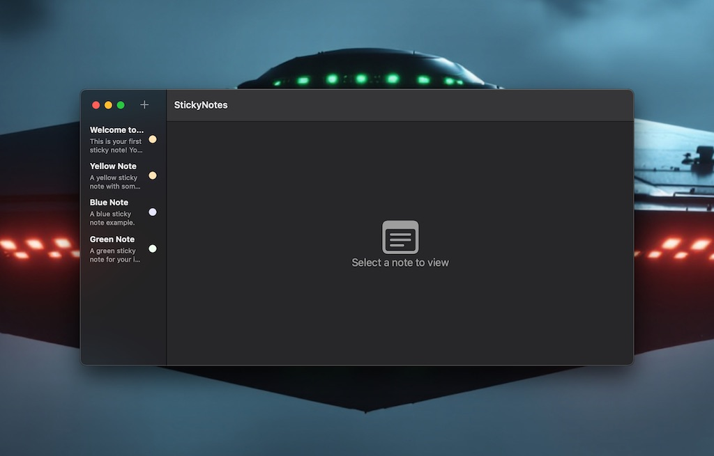

<p align="center">
  
  
  
  
</p>

# StickyNotes Desktop Application

## 📸 Main Interface



A modern, feature-rich macOS desktop sticky notes application built with SwiftUI and Core Data.

**Author:** Jasonn Michaels
**Repository:** [github.com/sanchez314c/desktop-stickies](https://github.com/sanchez314c/desktop-stickies)
**Contact:** [sanchez314c@jasonpaulmichaels.co](mailto:sanchez314c@jasonpaulmichaels.co)

## ✨ Features

- **SwiftUI Interface**: Modern, native macOS interface
- **Core Data Integration**: Local data persistence
- **Multiple Note Colors**: Organize notes with different colors
- **Rich Text Support**: Format your notes with rich text
- **Floating Windows**: Notes float above other applications

## Requirements

- macOS 13.0 or later
- Xcode 15.0 or later
- Swift 5.10 or later

## Building

1. Clone the repository:
   ```bash
   git clone https://github.com/sanchez314c/desktop-stickies.git
   cd desktop-stickies
   ```

2. Open the project in Xcode:
   ```bash
   open StickyNotes.xcodeproj
   ```

3. Build and run in Xcode (⌘R)

## Architecture

### Project Structure
```
StickyNotes/
├── StickyNotesApp.swift          # Main application entry point
├── Models/                       # Data models
│   ├── Note.swift
│   ├── NoteColor.swift
│   └── Note+CoreData.swift
├── Views/                        # SwiftUI views
│   ├── NoteWindowView.swift
│   ├── RichTextEditor.swift
│   └── FloatingNoteWindow.swift
├── ViewModels/                   # View models
│   ├── NotesViewModel.swift
│   └── NoteViewModel.swift
├── Services/                     # Business logic services
│   ├── CoreDataPersistenceService.swift
│   ├── CacheService.swift
│   └── WindowManager.swift
├── CoreData/                     # Core Data stack
│   └── PersistenceController.swift
├── Resources/                    # App resources
│   ├── Assets.xcassets
│   └── StickyNotes.entitlements
└── StickyNotesCommands.swift     # Menu commands
```

### Core Components

- **PersistenceController**: Manages the Core Data stack
- **NotesViewModel**: Manages the collection of notes
- **NoteViewModel**: Manages individual note state
- **WindowManager**: Handles note window management

## Usage

### Creating Notes

- Use `File > New Note` or press `⌘N`
- Click the "+" button in the toolbar
- Notes automatically save as you type

### Managing Notes

- Change colors using the color picker
- Resize notes by dragging the corner
- Close notes to hide them (they're saved)
- Delete notes using the delete menu

## Contributing

1. Fork the repository
2. Create a feature branch
3. Make your changes
4. Test thoroughly
5. Submit a pull request

## License

This project is licensed under the MIT License - see the [LICENSE](LICENSE) file for details.