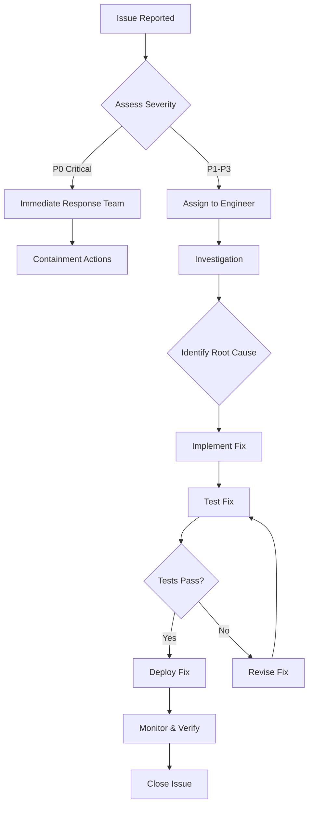

# Maintenance Guide

Comprehensive maintenance procedures for StickyNotes operations and support.

## 📋 Maintenance Overview

### Maintenance Categories

- **🔧 Preventive Maintenance**: Regular upkeep to prevent issues
- **🚨 Reactive Maintenance**: Issue response and resolution
- **📈 Performance Maintenance**: Optimization and monitoring
- **🔒 Security Maintenance**: Security updates and patches
- **📊 Data Maintenance**: Backup, recovery, and data management

### Maintenance Schedule

```
Daily    │ System health checks, log review, backup verification
Weekly   │ Performance monitoring, dependency updates, security scans
Monthly  │ Full system audit, capacity planning, user feedback review
Quarterly│ Major updates, architecture review, compliance checks
Annually │ Disaster recovery testing, long-term planning
```

## 🔧 Preventive Maintenance

### Daily Maintenance Tasks

#### System Health Checks
```bash
#!/bin/bash
# daily-health-check.sh

echo "=== StickyNotes Daily Health Check ==="
echo "Date: $(date)"

# Check application status
echo "Application Status:"
if pgrep -f "StickyNotes" > /dev/null; then
    echo "✅ StickyNotes is running"
else
    echo "❌ StickyNotes is not running"
fi

# Check disk space
echo "Disk Space:"
df -h / | awk 'NR==2 {print "Used: " $3 "/" $2 " (" $5 " used)"}'

# Check memory usage
echo "Memory Usage:"
vm_stat | awk '/Pages free/ {free=$3} /Pages active/ {active=$3} END {total=free+active; print "Free: " free*4096/1024/1024 "MB, Active: " active*4096/1024/1024 "MB"}'

# Check for crash logs
echo "Recent Crashes:"
find ~/Library/Logs/DiagnosticReports -name "*StickyNotes*" -mtime -1 | wc -l | xargs echo "Crash reports in last 24h:"

# Check log file sizes
echo "Log File Sizes:"
find ~/Library/Logs -name "*stickynotes*" -exec ls -lh {} \; 2>/dev/null

echo "=== Health Check Complete ==="
```

#### Backup Verification
```bash
#!/bin/bash
# verify-backups.sh

echo "=== Backup Verification ==="

# Check Time Machine status
echo "Time Machine Status:"
tmutil status | grep -E "(Running|Latest)"

# Check backup size
echo "Backup Size:"
tmutil listbackups 2>/dev/null | tail -1 | xargs tmutil uniquesize

# Verify application data backup
echo "Application Data Backup:"
if [ -d "/Volumes/Time Machine Backups/Backups.backupdb" ]; then
    find "/Volumes/Time Machine Backups/Backups.backupdb" -name "*StickyNotes*" -mtime -7 | wc -l | xargs echo "StickyNotes backups in last week:"
fi

echo "=== Backup Verification Complete ==="
```

### Weekly Maintenance Tasks

#### Performance Monitoring
```bash
#!/bin/bash
# weekly-performance-check.sh

echo "=== Weekly Performance Check ==="

# Run performance benchmarks
echo "Running performance tests..."
cd /path/to/StickyNotes
swift test --filter PerformanceTests

# Check system performance
echo "System Performance:"
echo "CPU Usage:"
top -l 1 | head -10

echo "Memory Usage:"
vm_stat | head -10

# Check for memory leaks
echo "Checking for memory issues..."
leaks StickyNotes 2>/dev/null || echo "Unable to check leaks (app not running)"

echo "=== Performance Check Complete ==="
```

#### Dependency Updates
```bash
#!/bin/bash
# update-dependencies.sh

echo "=== Dependency Update Check ==="

cd /path/to/StickyNotes

# Check for Swift package updates
echo "Checking Swift packages..."
swift package update

# Check for outdated packages
swift package show-dependencies

# Run tests after update
echo "Running tests after update..."
swift test

# Check for security vulnerabilities
echo "Checking for security issues..."
# Use appropriate security scanning tool

echo "=== Dependency Update Complete ==="
```

#### Security Scans
```bash
#!/bin/bash
# security-scan.sh

echo "=== Security Scan ==="

# Check file permissions
echo "File Permissions:"
ls -la /Applications/StickyNotes.app

# Check for unsigned code
echo "Code Signature:"
codesign -vv /Applications/StickyNotes.app

# Check for known vulnerabilities
echo "Vulnerability Scan:"
# Use vulnerability scanning tool

# Check network connections
echo "Network Connections:"
lsof -i -P | grep StickyNotes

echo "=== Security Scan Complete ==="
```

### Monthly Maintenance Tasks

#### Full System Audit
```bash
#!/bin/bash
# monthly-system-audit.sh

echo "=== Monthly System Audit ==="

# Comprehensive health check
echo "System Information:"
system_profiler SPSoftwareDataType SPHardwareDataType

# Check all logs
echo "Log Analysis:"
find ~/Library/Logs -name "*stickynotes*" -exec grep -l "ERROR\|CRASH" {} \; | wc -l | xargs echo "Error logs found:"

# Database integrity check
echo "Database Check:"
# Core Data integrity check

# User data analysis
echo "User Data Statistics:"
# Analyze note counts, sizes, etc.

# Performance trend analysis
echo "Performance Trends:"
# Analyze performance metrics over time

echo "=== System Audit Complete ==="
```

#### Capacity Planning
```bash
#!/bin/bash
# capacity-planning.sh

echo "=== Capacity Planning ==="

# Current usage
echo "Current Usage:"
echo "Notes count: $(count_notes)"
echo "Database size: $(database_size)"
echo "Cache size: $(cache_size)"

# Growth trends
echo "Growth Trends:"
# Analyze usage growth over time

# Resource projections
echo "Resource Projections:"
# Project future resource needs

# Recommendations
echo "Recommendations:"
# Provide capacity recommendations

echo "=== Capacity Planning Complete ==="
```

## 🚨 Reactive Maintenance

### Incident Response

#### Incident Classification
- **P0 - Critical**: App completely unusable, data loss
- **P1 - High**: Major functionality broken, widespread impact
- **P2 - Medium**: Feature broken, limited impact
- **P3 - Low**: Minor issue, cosmetic problems

#### Response Procedures

##### P0 Critical Incident
1. **Immediate Assessment** (0-15 minutes)
   - Assess impact and scope
   - Notify engineering team
   - Begin rollback preparations

2. **Containment** (15-60 minutes)
   - Stop deployment if applicable
   - Implement temporary workaround
   - Communicate with users

3. **Recovery** (1-4 hours)
   - Deploy fix or rollback
   - Verify system stability
   - Monitor for additional issues

4. **Post-Mortem** (1-2 days)
   - Root cause analysis
   - Documentation updates
   - Prevention measures

##### Issue Resolution Workflow


### Common Issues and Solutions

#### Application Won't Start
**Symptoms:** Double-clicking app does nothing, or error message appears

**Troubleshooting Steps:**
1. Check system requirements
2. Verify app integrity: `codesign -vv /Applications/StickyNotes.app`
3. Check crash logs: `~/Library/Logs/DiagnosticReports/`
4. Reset app preferences: `defaults delete com.superclaude.stickynotes`
5. Reinstall application

#### Performance Degradation
**Symptoms:** App slow to respond, high CPU/memory usage

**Resolution Steps:**
1. Check system resources: Activity Monitor
2. Clear caches: `rm -rf ~/Library/Caches/com.superclaude.stickynotes`
3. Reset preferences to defaults
4. Check for conflicting applications
5. Update to latest version

#### Data Corruption
**Symptoms:** Notes not loading, corrupted content, crashes on access

**Recovery Steps:**
1. **Immediate**: Stop using the app
2. **Backup**: Create Time Machine backup if possible
3. **Recovery**: Use Time Machine to restore from before corruption
4. **Prevention**: Enable automatic backups, regular exports

#### Sync Issues
**Symptoms:** iCloud sync not working, conflicts not resolving

**Resolution Steps:**
1. Check iCloud account status
2. Verify internet connectivity
3. Reset sync: Delete local data and re-sync
4. Check iCloud storage space
5. Contact Apple support if iCloud issues

## 📈 Performance Maintenance

### Performance Monitoring

#### Key Metrics to Monitor
- **Startup Time**: Cold and warm start times
- **Memory Usage**: Baseline and peak usage
- **CPU Usage**: Average and peak utilization
- **Search Performance**: Response times for different dataset sizes
- **UI Responsiveness**: Frame rates and input lag

#### Monitoring Tools
```bash
# Real-time monitoring
#!/bin/bash
# performance-monitor.sh

while true; do
    echo "$(date): CPU: $(ps aux | grep StickyNotes | grep -v grep | awk '{print $3}')% Memory: $(ps aux | grep StickyNotes | grep -v grep | awk '{print $4}')%"
    sleep 60
done
```

#### Performance Baselines
- **Startup Time**: <2s cold, <500ms warm
- **Memory Usage**: <100MB baseline, <200MB with 1000 notes
- **CPU Usage**: <5% average, <15% peak
- **Search (1000 notes)**: <100ms
- **UI Responsiveness**: 60 FPS

### Optimization Procedures

#### Memory Optimization
```swift
// Regular cleanup
class MemoryManager {
    static func performCleanup() {
        // Clear caches
        URLCache.shared.removeAllCachedResponses()
        
        // Force garbage collection if needed
        // Note: Swift uses ARC, but we can help
        
        // Clear temporary files
        let tempDir = FileManager.default.temporaryDirectory
        try? FileManager.default.removeItem(at: tempDir.appendingPathComponent("stickynotes"))
    }
}
```

#### Database Optimization
```swift
// Regular maintenance
class DatabaseManager {
    func performMaintenance() async throws {
        let context = persistentContainer.viewContext
        
        // Rebuild indexes if needed
        try await context.perform {
            // Database maintenance operations
        }
        
        // Vacuum database
        try persistentContainer.persistentStoreCoordinator
            .persistentStores
            .forEach { store in
                if let url = store.url {
                    try context.persistentStoreCoordinator?
                        .remove(store)
                    try context.persistentStoreCoordinator?
                        .addPersistentStore(ofType: NSSQLiteStoreType, configurationName: nil, at: url)
                }
            }
    }
}
```

## 🔒 Security Maintenance

### Security Updates

#### Regular Security Tasks
```bash
#!/bin/bash
# security-maintenance.sh

echo "=== Security Maintenance ==="

# Update certificates
echo "Checking certificates..."
security find-identity -v -p codesigning

# Check for security updates
echo "Checking for updates..."
softwareupdate --list

# Verify code signatures
echo "Verifying signatures..."
codesign -vv /Applications/StickyNotes.app

# Check file permissions
echo "Checking permissions..."
ls -la /Applications/StickyNotes.app

echo "=== Security Maintenance Complete ==="
```

#### Security Monitoring
- Monitor for unusual access patterns
- Check for unauthorized modifications
- Verify data encryption status
- Review security logs regularly

### Incident Response Plan

#### Security Breach Response
1. **Detection**: Identify security incident
2. **Containment**: Isolate affected systems
3. **Investigation**: Determine scope and impact
4. **Recovery**: Restore secure state
5. **Lessons Learned**: Update security measures

## 📊 Data Maintenance

### Backup Procedures

#### Automated Backups
```bash
#!/bin/bash
# automated-backup.sh

BACKUP_DIR="$HOME/Documents/StickyNotes-Backups"
DATE=$(date +%Y%m%d_%H%M%S)

# Create backup directory
mkdir -p "$BACKUP_DIR"

# Backup application data
echo "Backing up application data..."
cp -r ~/Library/Containers/com.superclaude.stickynotes "$BACKUP_DIR/backup_$DATE"

# Backup preferences
echo "Backing up preferences..."
cp ~/Library/Preferences/com.superclaude.stickynotes.plist "$BACKUP_DIR/preferences_$DATE.plist"

# Compress backup
echo "Compressing backup..."
tar -czf "$BACKUP_DIR/backup_$DATE.tar.gz" -C "$BACKUP_DIR" "backup_$DATE" "preferences_$DATE.plist"

# Clean old backups (keep last 30)
echo "Cleaning old backups..."
ls -t "$BACKUP_DIR"/*.tar.gz | tail -n +31 | xargs rm -f

echo "Backup complete: $BACKUP_DIR/backup_$DATE.tar.gz"
```

#### Manual Backup
1. Export all notes to desired format
2. Backup application preferences
3. Create Time Machine backup
4. Store backups in secure location

### Data Recovery

#### Recovery Procedures
```bash
#!/bin/bash
# data-recovery.sh

BACKUP_FILE="$1"

if [ -z "$BACKUP_FILE" ]; then
    echo "Usage: $0 <backup_file>"
    exit 1
fi

echo "Starting data recovery from $BACKUP_FILE"

# Stop application
killall StickyNotes 2>/dev/null

# Extract backup
TEMP_DIR=$(mktemp -d)
tar -xzf "$BACKUP_FILE" -C "$TEMP_DIR"

# Restore data
echo "Restoring application data..."
cp -r "$TEMP_DIR/backup_"* ~/Library/Containers/com.superclaude.stickynotes

echo "Restoring preferences..."
cp "$TEMP_DIR/preferences_"*.plist ~/Library/Preferences/com.superclaude.stickynotes.plist

# Clean up
rm -rf "$TEMP_DIR"

# Restart application
open /Applications/StickyNotes.app

echo "Data recovery complete"
```

#### Recovery Testing
- Regular recovery testing from backups
- Verify data integrity after recovery
- Test application functionality post-recovery
- Document recovery time and success rate

### Data Migration

#### Version Migration
```swift
class DataMigrationManager {
    func migrate(fromVersion: String, toVersion: String) async throws {
        switch (fromVersion, toVersion) {
        case ("1.0.0", "1.1.0"):
            try await migrate_1_0_0_to_1_1_0()
        case ("1.1.0", "2.0.0"):
            try await migrate_1_1_0_to_2_0_0()
        default:
            throw MigrationError.unsupportedMigration
        }
    }
    
    private func migrate_1_0_0_to_1_1_0() async throws {
        // Add new fields, update data structure
        let context = persistentContainer.viewContext
        // Migration logic here
    }
}
```

## 📋 Maintenance Checklists

### Daily Checklist
- [ ] System health check completed
- [ ] Backup verification successful
- [ ] Log files reviewed
- [ ] No critical errors in logs
- [ ] Application responding normally

### Weekly Checklist
- [ ] Performance benchmarks run
- [ ] Dependency updates checked
- [ ] Security scans completed
- [ ] Disk space adequate
- [ ] Memory usage normal

### Monthly Checklist
- [ ] Full system audit completed
- [ ] Capacity planning reviewed
- [ ] User feedback addressed
- [ ] Documentation updated
- [ ] Compliance requirements met

### Quarterly Checklist
- [ ] Major updates deployed
- [ ] Architecture review completed
- [ ] Security assessment done
- [ ] Disaster recovery tested
- [ ] Team training updated

## 📞 Support Procedures

### User Support

#### Support Tiers
- **Tier 1**: Basic troubleshooting, common issues
- **Tier 2**: Complex issues, data recovery
- **Tier 3**: Critical issues, development team

#### Support Workflow
1. **Initial Assessment**: Categorize and prioritize issue
2. **Investigation**: Gather information and reproduce issue
3. **Resolution**: Implement fix or workaround
4. **Follow-up**: Verify resolution and prevent recurrence

### Internal Support

#### Team Communication
- **Daily Standup**: Quick status updates
- **Weekly Review**: Detailed progress and blockers
- **Monthly Planning**: Long-term maintenance planning
- **Incident Reviews**: Post-mortem analysis

#### Documentation
- **Runbooks**: Step-by-step procedures
- **Knowledge Base**: Common issues and solutions
- **Change Logs**: Track all system changes
- **Contact Lists**: Emergency contact information

## 🚨 Emergency Procedures

### Critical System Failure
1. **Assessment**: Determine impact and scope
2. **Communication**: Notify stakeholders
3. **Containment**: Prevent further damage
4. **Recovery**: Restore from backups
5. **Analysis**: Determine root cause

### Data Loss Emergency
1. **Stop Operations**: Prevent further data loss
2. **Assess Damage**: Determine what data is lost
3. **Recovery Options**: Evaluate recovery possibilities
4. **Execute Recovery**: Restore from best available backup
5. **Verification**: Confirm data integrity

### Security Incident
1. **Detection**: Identify security breach
2. **Containment**: Isolate affected systems
3. **Investigation**: Determine breach scope and method
4. **Recovery**: Restore secure state
5. **Reporting**: Notify authorities if required

---

*This maintenance guide ensures StickyNotes remains reliable, secure, and performant. Regular maintenance prevents issues and ensures optimal user experience.*